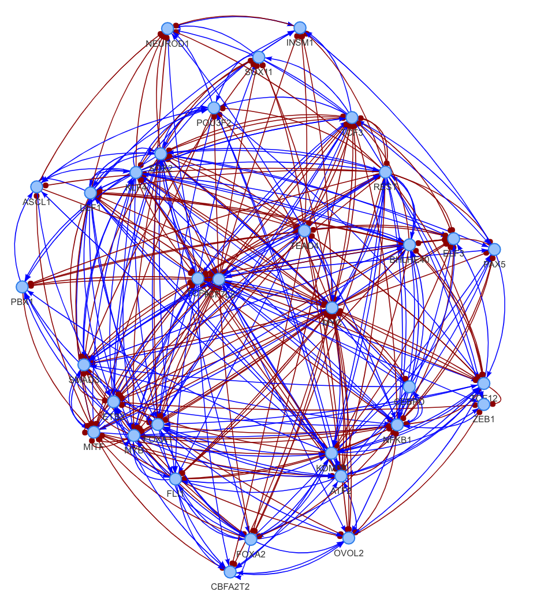
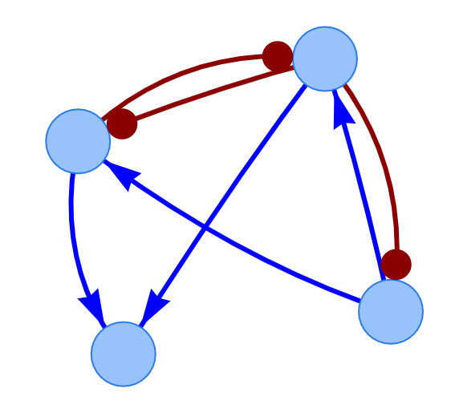

```{r setup, include=FALSE}
knitr::opts_chunk$set(echo = TRUE, warning = FALSE, message = FALSE, fig.width = 7, fig.height = 6, fig.align = "center")
```

# Introduction

SacoGraci (*i.e.*, *Sa*mpling *co*arse-*Gra*ined *ci*rcuits) is a data-driven method for coarse-graining large gene regulatory networks (GRNs) into coarse-grained gene circuits (CGCs) using ensemble-based mathematical modeling ([RACIPE](https://www.bioconductor.org/packages/release/bioc/html/sRACIPE.html)), dimensionality reduction and gene circuit optimization by Markov Chain Monte Carlo (MCMC) methods. SacoGraci requires network topology as the only input and is robust against errors in GRNs. In this tutorial, we illustrate the usage of SacoGraci using a GRN of SCLC ([Udyavar et al., 2017](https://doi.org/10.1158/0008-5472.CAN-16-1467)) consisting of 33 transcription factors.

# Load network topology and perform RACIPE simulations

First, the topology of the GRN is loaded. The topology file "Ex_topology.csv" is in the CSV format showing the regulator (source), target gene (target), and the interaction type (type) for every network edge. Here, the interaction type can be either activation (1) or inhibition (2).

```{r}
library(SacoGraci)
set.seed(43)
top_ex = read.csv("Ex_topology.csv", header=T)
```

The network topology can be visualized with function "plot_network" 
```
plot_network(top_ex4)
```
<center> {width=50%} </center>

Once the GRN is loaded, RACIPE is performed to simulate the steady-state gene expression profiles from mathematical models with randomly generated kinetic parameters. We recommend to generate 10,000 models. In this tutorial, we illustrate the workflow with 1,000 RACIPE models. The results from this step in the tutorial can be retried from the  *vignettes* folder on our GitHub ("exp_data_RACIPE_ex.RDS").

```
data_exp = gen_RACIPE(top_ex, 1000)
```

```{r}
data_exp = readRDS("exp_data_RACIPE_ex.RDS")
```

# Group models and genes

Next, we perform clustering analysis on the RACIPE-simulated gene expression profiles to identify the gene expression clusters (model clusters) and gene clusters. The model clusters specifies the gene expression states required to be captured in the optimal CGC; the gene clusters specifies the grouping scheme for the nodes of the CGC. We recommend to first visualize the gene expression profiles from the full network using heatmap (together with hierarchical clustering analysis) and principal component analysis. Here, we use HCA to identify three model clusters and four gene clusters. SacoGraci also provides a few other options for model and gene grouping, including k-means (modClustKmeans), gene clustering by the median expression of each model cluster (geneClustMedian). 

```{r}
gen_heatmap_hca(logscData = data_exp)  # heatmap visualization
gen_pca_plot(logscData = data_exp)  # pca visualization

output_model_grouping = modClustHCA(logscData = data_exp,numbClust = 3)  # model clustering with HCA, we specify 3 clusters
data_reordered = output_model_grouping$dataRearr  # reordered gene expression data by the clustering outcome
clusterRef = output_model_grouping$clInd  # cluster indices of all models

output_gene_grouping = geneClustInd(logscData = data_reordered,numbGeneClust = 4)  # gene clustering with HCA, we specify 4 cluster

shG = c(2,3,4,1)  # an example of the designed order to arrange genes. (optional; if not provided, the default sequence will be used) 
output_processed = reordering(logscData = data_reordered, gene_list = output_gene_grouping, geneGroupOrder = shG) # reordered gene expression data by the clustering outcome

data_processed = output_processed$data
gene_list = output_processed$gene_list
```

Users can also provide their own grouping schemes, as illustrated in the following example.

```
# show how to generate model_list and gene_list manually
clusterRef =  c(rep(1, 587), ref(2,398), ref(3,15))
gene_list = list()
gene_list[[1]] = c("SOX2","TCF3","MYB","FOXA2","KDM5B","POU3F2","PBX1","SOX11","FLI1","TCF4","LEF1",   
                   "ATF2","ETS2","FOXA1","ELF3","TCF12","PAX5","OVOL2","ASCL1","CBFA2T2","INSM1")
gene_list[[2]] = c("CEBPD")
gene_list[[3]] = c("NEUROD1")
gene_list[[4]] = c("KLF4","SMAD3","MYC","REST","TCF7L2","TEAD4","MITF","NFKB1","BHLHE40","ZEB1")
```

# Compute the centers and radii of model clusters 

Once the model clusters have been defined, SacoGraci computes the centers and the radii of for all clusters. These data are required for evaluating the scores of CGC candidates. "percThr" specifies threshold for the mutation test used to compute the radius of each model cluster.

```{r}
stat_clusters <-centMedVarCutDistPerc(data = data_processed, clusterRef = clusterRef, percThr = 0.01)
```

# Generate initial starting CG circuits

To start the circuit optimization process, we start with generating some initial gene circuits based on the topology of the full network and the gene grouping scheme. "numbNewTop" specifies the number of initial circuits to be generated. 

```{r}
inTopsM <-gaInitial_gen(circuit_top = top_ex, gene_list = gene_list, numbNewTop = 90)
```

# Optimize circuit with Metropolis-Hastings (MH)

SacoGraci_optimization is the main function for circuit optimization. Due to high computational cost, we recommend to use high performance computing resources. We recommend to use (nRepeat= 5, nIter = 1400, modelsCGr = 10000) for a robust circuit optimization. But in the illustration, we chose the following parameters to only to generate quick results. The temperature ("temM") is set to be 60 in this example. 
 
```{r, results='hide'}
circuit1 = opt_MH(network_top = top_ex, data = data_processed, clusterRef = clusterRef, 
                  cenMedRef = stat_clusters$center, cutOffM = stat_clusters$radius, 
                  gene_list = gene_list, init_top = inTopsM[1,], 
                  output = "Results1", nRepeat= 1, nIter = 10, modelsCGr = 100, 
                  tempM = 60)
```

The topology of the optimized CGC can be visualized with "plot_network" 

```
plot_network(circuit1)
```
<center> {width=30%} </center>

One can choose to use other sampling algorithms.

* Simulated annealing (SA): (check *?opt_SA* for recommended parameters)

```
circuit2 = opt_SA(network_top = top_ex, data = data_processed, clusterRef = clusterRef, 
                  cenMedRef = stat_clusters$center, cutOffM = stat_clusters$radius, 
                  gene_list = gene_list, init_top = inTopsM[1,], 
                  output = "Results2", nRepeat= 1, modelsCGr = 100, 
                  maxT=150, threshT=40, decayRate1=0.8, decayRate2=0.6, iter_per_temp=2)
plot_network(circuit2)
```

* MH with multiple threads: (check *?opt_MH_multi* for recommended parameters)

```
circuit3 = opt_MH_multi(network_top = top_ex, data = data_processed, clusterRef = clusterRef, 
                  cenMedRef = stat_clusters$center, cutOffM = stat_clusters$radius, 
                  gene_list = gene_list, inTopsM = inTopsM, 
                  output = "Results3", nRepeat= 1, nIter = 10, modelsCGr = 100, 
                  tempM = 60, numbThr = 2, nSim = 2)
plot_network(circuit3)
```

* SA with multiple threads: (check *?opt_MA_multi* for recommended parameters)

```
circuit4 = opt_SA_multi(network_top = top_ex, data = data_processed, clusterRef = clusterRef, 
                  cenMedRef = stat_clusters$center, cutOffM = stat_clusters$radius, 
                  gene_list = gene_list, inTopsM = inTopsM, 
                  output = "Results4", nRepeat= 1, modelsCGr = 100, 
                  maxT=150, threshT=40, decayRate1=0.8, decayRate2=0.6, iter_per_temp=2,
                  numbThr = 2, nSim = 2)
plot_network(circuit4)
```

* TE with multiple threads: (check *?opt_TE* for recommended parameters)

```
circuit5 = opt_TE(network_top = top_ex, data = data_processed, clusterRef = clusterRef, 
                  cenMedRef = stat_clusters$center, cutOffM = stat_clusters$radius, 
                  gene_list = gene_list, inTopsM = inTopsM, 
                  output = "Results5", nRepeat= 1, modelsCGr = 100, 
                  numbThr = 4, temp_Array=c(1,10,50,100), iter_temp_add=c(2,2,2), 
                  numb_iter_extra = 4, logAlpha = log(0.4))
plot_network(circuit5)
```

# References

Caranica & Lu (2022) A Data-Driven Optimization Method for Coarse-Graining Gene Regulatory Networks, bioRxiv xxx; doi: https://doi.org/xxx

# Session Information

```{r}
sessionInfo()
```